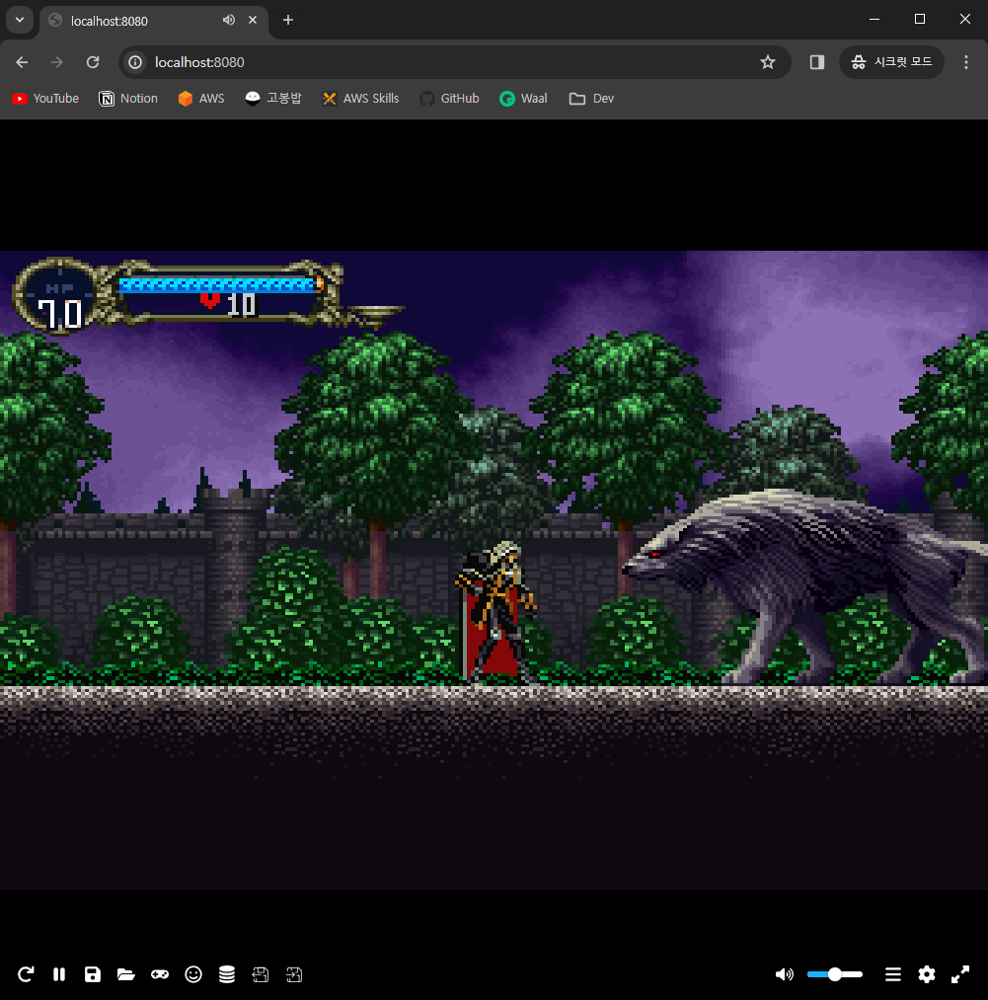

# EmulatorJS Container



## Configuration

1. Download a Game file(.zip, .rar, ...)

1. Put your Game file into `games/` directory

1. Set `EJS_core`, `EJS_gameUrl` (index.html) - [Reference](https://emulatorjs.org/docs/Systems.html) 

## Run

[EmulatorJS](https://emulatorjs.org/docs/Getting%20Started.html)

```bash
docker build -t emulatorjs-container .
docker run -d -p 8080:8080 emulatorjs-container
```